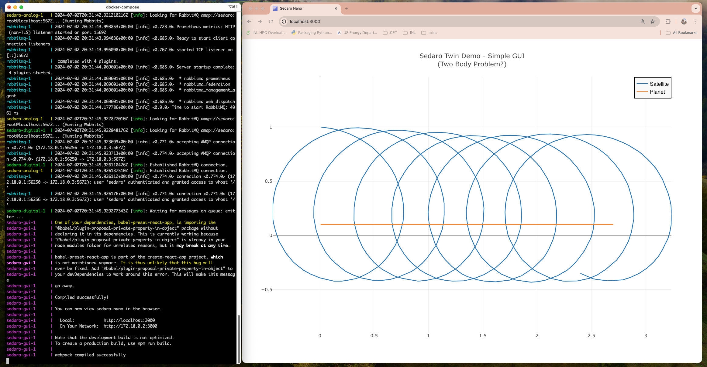

# Sedaro Analog- and Digital-Twins



### What is it?

* An experimental minimal mock-up of a Digital Twin Framework for Sedaro - in Rust.
* A proof-of-concept for running analog- and digital-twins in a distributed environment.
* A thought experiment as the basis for discussing digital twins, M&S, and data.
* A good chance to talk about Rust programming and the meaning of life.

### Setup and Running

* Open a browser to http://localhost:3000/ and wait for screen updates.
* In the main source directory (sedaro-twin) type ```docker compose up```.
* Say ***Doh!*** - because you forgot to install and run Docker.

### Troubleshooting

* Just wait for the presentation and demo.
* There will be a presentation and demo... right?
* Call Tom (740) 707-2711 and say "what the heck?".

### Salient thoughts on this project (in no apparent order)

* The new docker-compose.yml file will run 4 distributable services: an analog twin, a digital twin, the GUI, and a RabbitMQ queue for communicating state among the services.

* In this example project, the analog twin "records" simulated data generated by the Sedaro Nano exercise and transmits this "state" to the digital twin for analysis and display.  In the real world the data would come from hardware sensors or from sampling of a larger digital data source, such as telemetry of traffic data.

* There are plenty of frameworks for sharing data in distributed environments (Hadoop,Kafka,Cassandra,Redis,...).  The best choice really depends on the type and amount of data.  It is always hard to decide, but I tend to go with the simplest solution [https://en.wikipedia.org/wiki/William_of_Ockham].

* In this exercise, I used RabbitMQ to share "state" (the heartbeat of a digital twin) between the analog- and digital-twins. Ask me how this queue communication might be optimized?  What are queues good for and what are they bad for?  How should we best format data for communication?... all good questions.

* Can you have a digital twin without an analog twin?  Generally, I would say - no, but it depends on your definitions.  Ask me about my definitions.  I could argue either way.

* I implemented a single code set, and a single Dockerfile, for building a Sedaro analog- and Sedaro digital-twin.  Just as real life twins share the same DNA (code), Sedaro logical-twins share the same code (Rust).  

* I modified the GUI only slightly.  It will [now] refresh dynamically since it is running in its own container, separate from the data source. Communication with the GUI is via files, so it is not strictly distributable, but hey... it's a demo, and I am no GUI expert.

* Regarding Sedaro Nano simulation code , if you are serious about discrete simulation in Python you should check out SimPy https://simpy.readthedocs.io/en/latest/.  Of course, a rust implementation would be cool.

* Regarding the simulation algorithm... I started to implement this in Rust, but after a brief diversion where I tried to add another body to the problem, I decided t just use the python simulated data in the Sedaro Twin Proof-Of-Concept. I was not sure about necessity for the range to value map.  I think the python code might rely on python way of doing operation on mixed data (int and float).  

* If that function/algorithm is a key low-level part of Sedaro products it might be worth writing it in Rust. 
